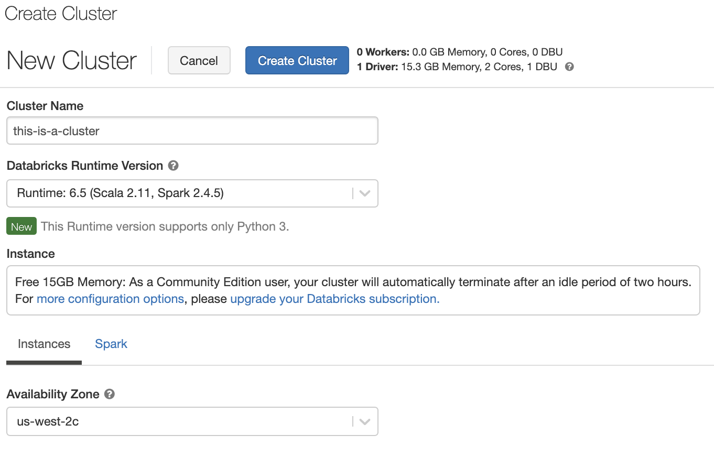
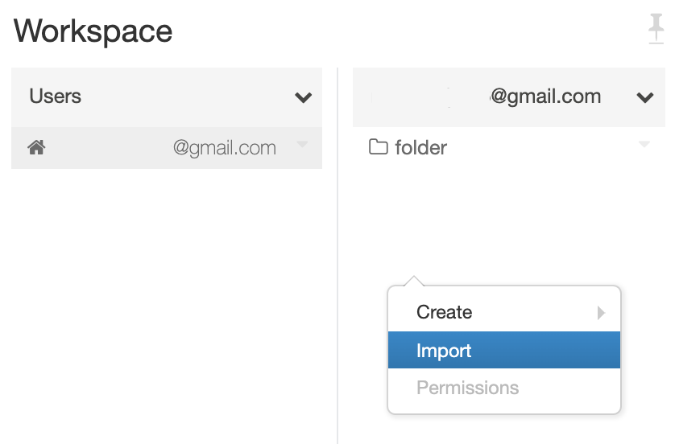
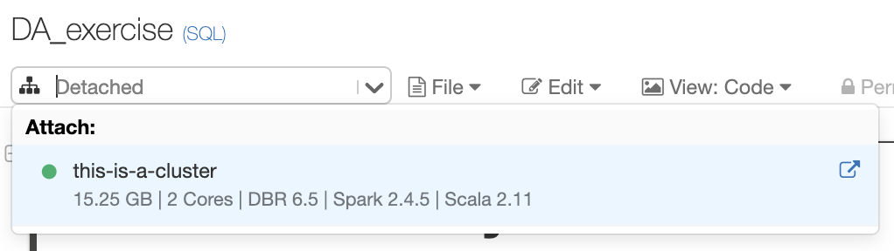
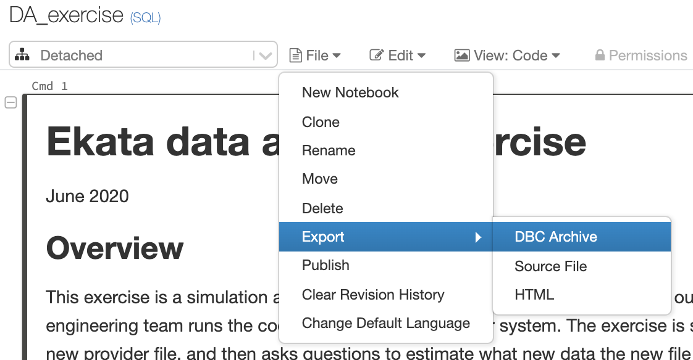

# Exercise instructions

June 2020

1. Download the DA_exercise.dbc file
2. Sign up for a [Databricks Community Edition](https://community.cloud.databricks.com/login.html) account
3. Click on Clusters on the left and click Create Cluster in the upper left
4. Give your cluster a name and click Create Cluster
    * You can leave the Databricks Runtime Version as the default, though there shouldn't be any difference if you select a newer version.
5. Next nagivate to your own workspace by selecting `Workspace -> Users -> your-username`
6. Right-click in this area and select Import and select the DA_exercise.dbc file you previously downloaded. After it is imported, click on the notebook within your workspace.
7. In the upper left click on the dropdown that says "Detached" and select the cluster you created before.

When you are done go to `File -> Export -> DBC Archive` and send the downloaded file back to us.

screenshots below

------------------

## Create cluster

## Import

## Select cluster

## Export file

